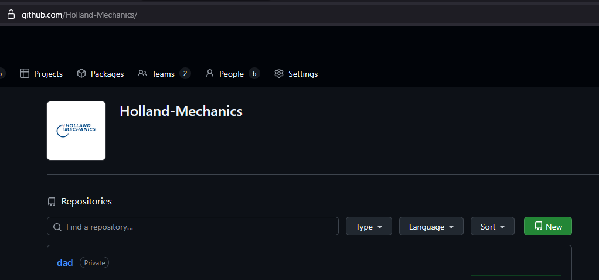
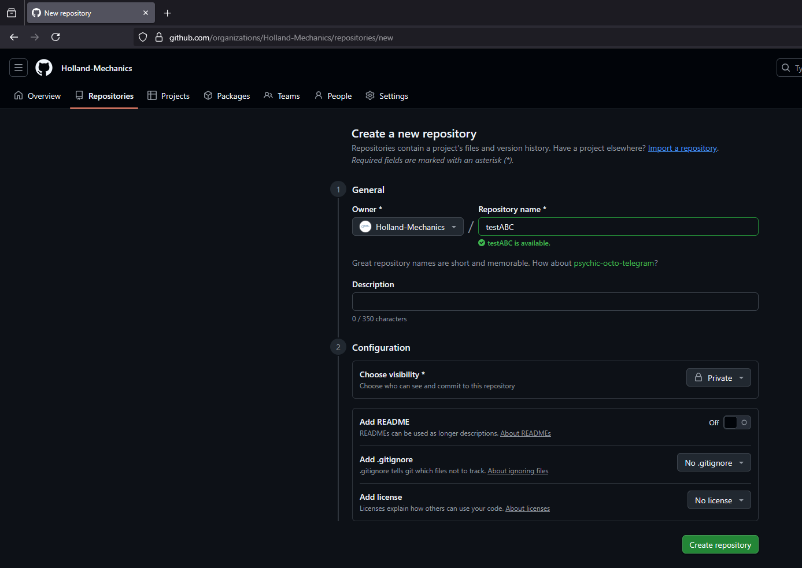
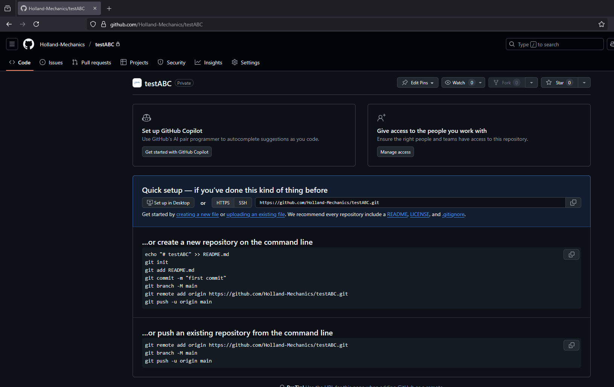

# Make a new git repository

## Goal
Create a new Git repository locally, add a README.md and push it to GitHub using the webbrowser, the commandline tool `gh.exe` or via a pyhon script.

## Prerequisites
- git installed and available in PATH
- gh.exe installed (GitHub CLI) and authenticated (OPTIONAL)

## Steps for webbrowser method

### 1 Navigate to [github.com/holland-mechanics]() 
and log in.

### 2 Create a repository 
Create a repository by pressing the green Button label `New` and fill in a name and optionally also a description. 



Make sure the visibily box is set to `private`. Optionally you can choose to add a readme.md and .gitignore as well


### 3 Run some command lines
As the webpage will also show, you need to run some command lines in a terminal to add, commit and push your files to the new repository. Or use an integrated git tool in your editor if you have it.

First enter 

   ```git init``` 
   
to make a local repo and add your files using 

   ```git add your_file.ext``` 
   
or add each and every file in the folder and subfolder at once.

   ```git add *``` 

Commit all your files using 

   ```git commit -a``` 
   
to the repository.

Make a main or master branch: 

   ```git branch -M main```

Add a remote with: 

   ```git remote add origin https://github.com/Holland-Mechanics/testABC.git```

And lastly push using  

```git push -u origin main``` 

Form this moment forward you can push by simply running 

```git push```



## Steps for Command line tool method (gh.exe)

### 1 Create folder and initialize repo
run in terminal

   ```
   mkdir HelloWorld
   cd HelloWorld
   git init
   ```

### 2 Optional: Create README.md with content
run in terminal
    
   ```
   touch README.md
   ```

### 3 Stage and commit
run in terminal
    
You need to all your files to the repository.

   ```
   git add README.md
   git add file.cpp
   git commit -m "Initial commit: added README.md"
   ```
   
You can add all files at once using. Make sure you provide a gitignore or that you not add artifact files.

   ```
   git add *
   git commit -am "added all files"
   ```

### 4 Create repository on GitHub and push

   Organization repository (holland-mechanics):
   run in terminal

    ```
    gh repo create holland-mechanics/HelloWorld --private --source . --remote origin --push
    ```

   Output should look like:
    
    ```
    $ gh repo create holland-mechanics/HelloWorld --private --source . --remote origin --push
    ✓ Created repository Holland-Mechanics/HelloWorld on github.com
    https://github.com/Holland-Mechanics/HelloWorld
    ✓ Added remote https://github.com/Holland-Mechanics/HelloWorld.git
    Enumerating objects: 3, done.
    Counting objects: 100% (3/3), done.
    Writing objects: 100% (3/3), 230 bytes | 115.00 KiB/s, done.
    Total 3 (delta 0), reused 0 (delta 0), pack-reused 0 (from 0)
    To https://github.com/Holland-Mechanics/HelloWorld.git
    * [new branch]      HEAD -> master
    branch 'master' set up to track 'origin/master'.
    ✓ Pushed commits to https://github.com/Holland-Mechanics/HelloWorld.git
    ```

   Notes:
   - `--private`   : create as private repo (use --public if desired)
   - `--source` .  : use current directory as source
   - `--remote origin` : set remote to "origin"
   - `--push`      : push the initial commit immediately


### 5 Verify if your repo is visible on github.com

   - Organization: `https://github.com/holland-mechanics/HelloWorld`

## Steps for the python script.
If the script is added to your system environment variables and python3 is installed. You can open a terminal and run the script from anywhere.

### 1 Launche the script
Launch the script In the project folder that you want to push to github, open a terminal and enter `create_new_repo_script.py`. This will launch the interactive script

### 2 follow the script
Enter a suitable name and answer the questions. The script will ask per file if you want to add it to the repo. Once you are done, the script will push all added files to github.com/holland-mechanics


## Troubleshooting

- If gh prompts interactively:
  - Provide the flags as shown above (name + --private/--public + --source + --remote + --push).
- If pushing to the org fails:
  - Ensure your gh session uses work credentials (gh auth status / gh auth switch)
  - Or set a work token for the session:
    - PowerShell:   $env:GH_TOKEN = "<WORK_PAT>"
    - Git Bash/CMD: export GH_TOKEN="<WORK_PAT>"
- If the repo already exists on GitHub:
  - Remove --push and instead:
    git remote add origin git@github.com:holland-mechanics/HelloWorld.git
    git push -u origin main
- If default branch is not "main":
  - Set it before first push:
    git branch -M main
    git push -u origin main

